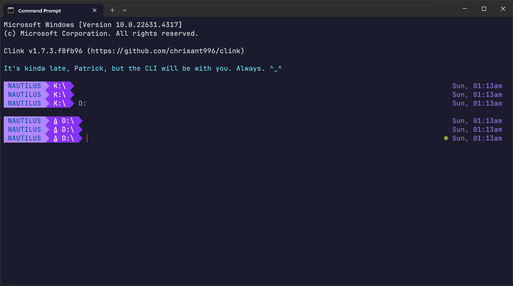
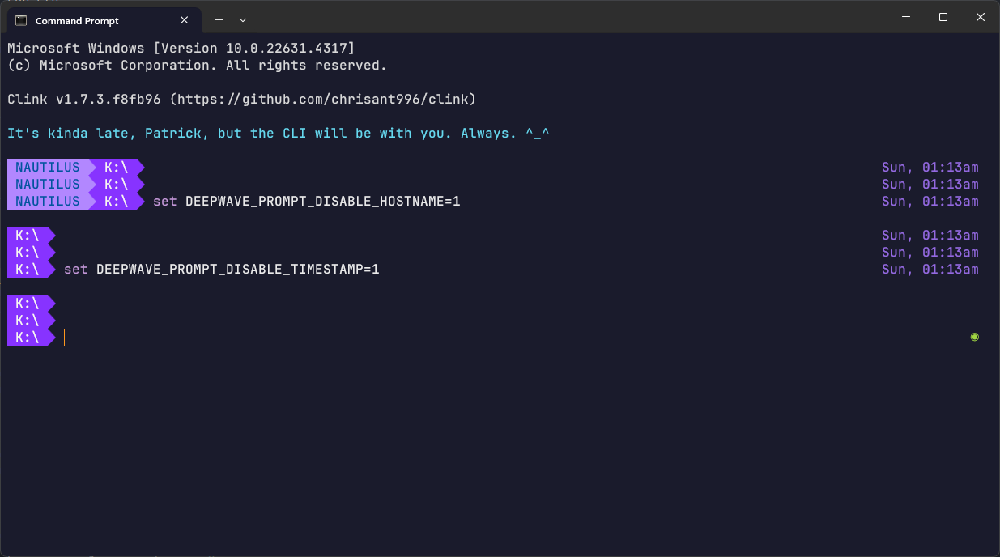
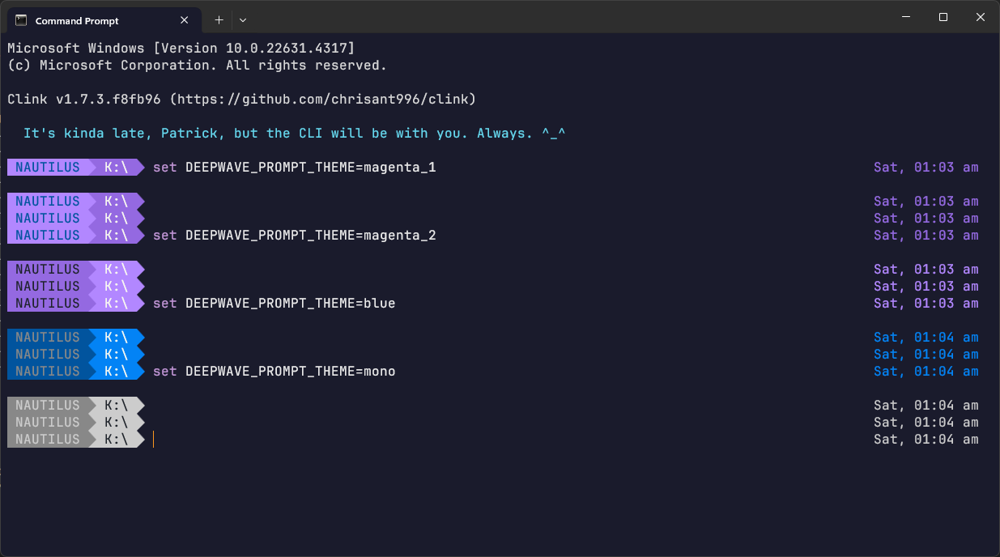
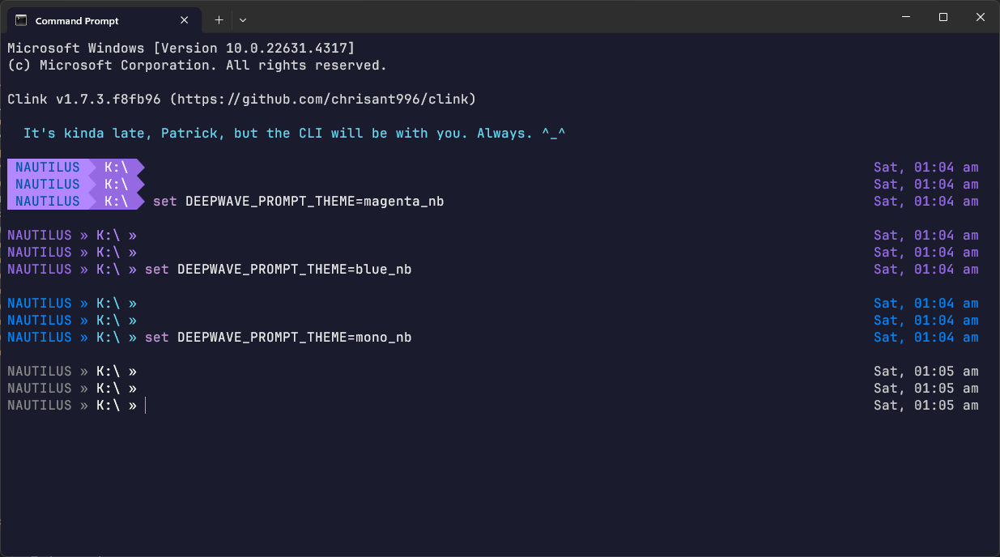
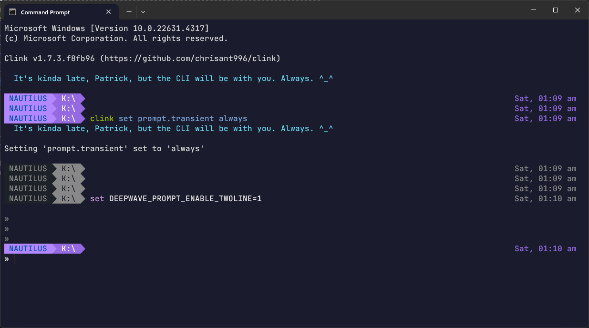
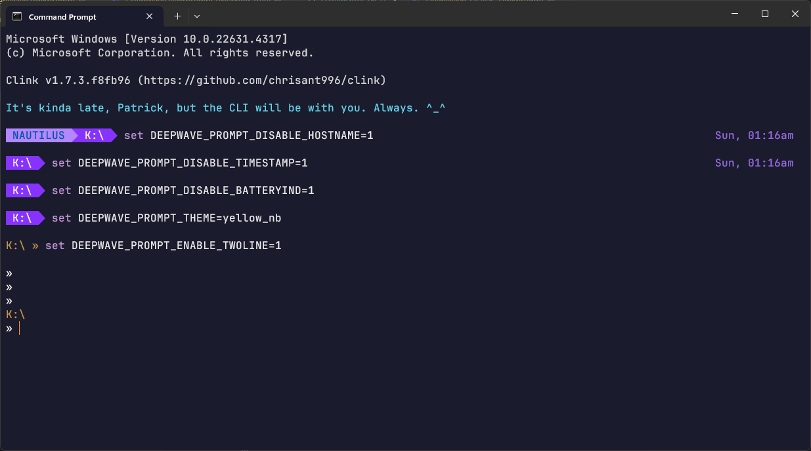
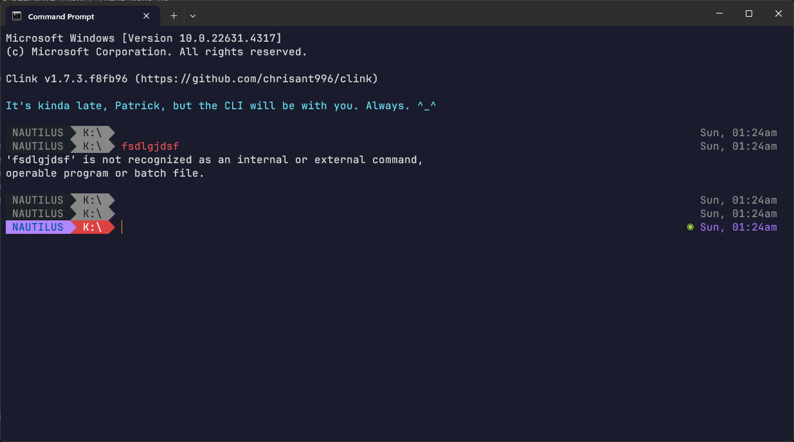

# DeepWave clinkprompt

This is a prompt module for [clink](https://github.com/chrisant996/clink) that is simple, but has a variety of options. It draws inspiration from a number of other prompts, but is primarily Windows-first, and not a *nix port. It is for power users of the command line (that's why we use `clink`) who see the venerable `C:\>` as its own unique shell *identity* **^_^**.

There is no `git` support here, so please try one of the other, very good, prompt modules if that is what you're looking for. Unlike *nix, `git` is not installed by default in Windows. Similarly, we don't look out for things like `~` because you can't `cd ~` on Windows.

### Features

You can customise your prompt in multiple ways, and optionally enable or disable the following display/modes:

* Timestamp
* Computer Name
* Previous Command Error Indicator
* Mute Previous Prompts
* Single-line or Two-line Prompt
* Colour Themes (or monochrome) - support for both default Windows fonts and Nerdfont/Powerline font
* Greeting Message

These features can be set/enabled/disabled on-the-fly by setting various environment variables. Changing these settings will affect the current terminal immediately. If you want these settings to be the default, set them as your default environment variables.

| Feature               | Default                                                      | To Change (disable or enable as the case may be)             |
| --------------------- | ------------------------------------------------------------ | ------------------------------------------------------------ |
| Display Timestamp     | Enabled                                                      | `set DEEPWAVE_PROMPT_DISABLE_TIMESTAMP=1 `                   |
| Display Computer Name | Enabled                                                      | `set DEEPWAVE_PROMPT_DISABLE_HOSTNAME=1 `                    |
| Error Indicator       | Enabled                                                      | `set DEEPWAVE_PROMPT_DISABLE_ERRORIND=1`                     |
| Mute Previous Prompts | Enabled Requires `clink set prompt.transient always` or `same_dir` | `clink set prompt.transient off`                             |
| Two-line Prompt       | Disabled                                                     | `set DEEPWAVE_PROMPT_ENABLE_TWOLINE=1` Requires `clink set prompt.transient always` or `same_dir` |
| Colour Theme          | `magenta_1`                                                  | `set DEEPWAVE_PROMPT_THEME=theme_name`                       |
| Greeting Message      | Enabled                                                      | `set DEEPWAVE_PROMPT_DISABLE_GREETING=1`                     |

Here's an example of disabling the *Timestamp* and *Computer Name*.

### Themes

There are two types of themes - those with a background, and those without.

If you have installed and configured a font with broader character support like `JetBrains Mono` or `FiraCode` (etc), then you can use themes that depend on a background, otherwise, you will see some strange characters in your prompt.

By default, `cmd.exe` (and `Windows Terminal`) uses `Consolas`, which does *not* have the correct character support. In that case, please use one of the themes that does not have a background.

| Theme                                 | To Activate                            |
| ------------------------------------- | -------------------------------------- |
| Magenta 1 (Light to Dark) (*Default*) | `set DEEPWAVE_PROMPT_THEME=magenta_1`  |
| Magenta 2 (Dark to Light)             | `set DEEPWAVE_PROMPT_THEME=magenta_2`  |
| Blue                                  | `set DEEPWAVE_PROMPT_THEME=blue`       |
| Monochrome                            | `set DEEPWAVE_PROMPT_THEME=mono`       |
| Magenta (No Background)               | `set DEEPWAVE_PROMPT_THEME=magenta_nb` |
| Blue (No Background)                  | `set DEEPWAVE_PROMPT_THEME=blue_nb`    |
| Monochrome (No Background)            | `set DEEPWAVE_PROMPT_THEME=mono_nb`    |

Here's a look at some of these themes, firstly with backgrounds, and then without. These screenshots were taken with *Mute Previous Prompts* disabled.

### Two-line Prompt Mode

If you wish to enable *Two-line Prompt* mode, you need to enable transient prompts in clink. This will also activate *Mute Previous Prompts*. But do note that when Two-line Prompt is active, we do not display the previous Timestamps or 2nd Lines. This is because the display becomes just too crowded.

Here's a minimalist *Two-line Prompt* mode.

Finally, here is how the *Error Indicator* is handled in *Two-line Prompt* mode.

### Requirements and Installing

1. Install [clink version 1.7.0](https://github.com/chrisant996/clink/releases) or newer (which supports `*.clinkprompt` custom prompt files)
2. Download the [DeepWave.clinkprompt](DeepWave.clinkprompt) file to the [clink theme](https://chrisant996.github.io/clink/clink.html#custom-prompts) folder
3. Activate the prompt with `clink config prompt use DeepWave` 
4. *[Optional]* Install and configure `Windows Terminal` or `cmd.exe` to use a font with broader character support (eg. [JetBrains Mono](https://www.jetbrains.com/lp/mono/), [Nerdfonts](https://www.nerdfonts.com/font-downloads) or [Powerline fonts](https://github.com/powerline/fonts))
5. *[Optional]* Configure the prompt settings if you need to, using environment variables

### Thanks and Acknowledgements

Thanks to, Inspiration and Code from:

* [clink](https://github.com/chrisant996/clink)
* [agnoster](https://github.com/agnoster/agnoster-zsh-theme)
* [pure](https://github.com/sindresorhus/pure)

This code is MIT Licensed - Feel free to share and adapt, but please attribute ^_^

And if you like this prompt, or if you fork/reference/use it, do drop me a note to say hi. I'd love to hear how my code is useful to others and where it has traveled to. ^_^
