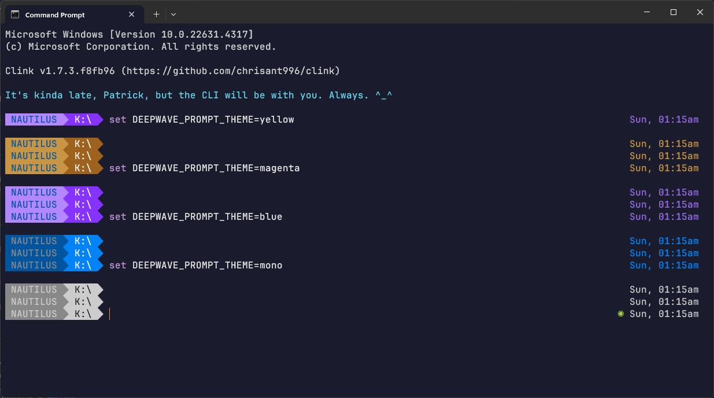
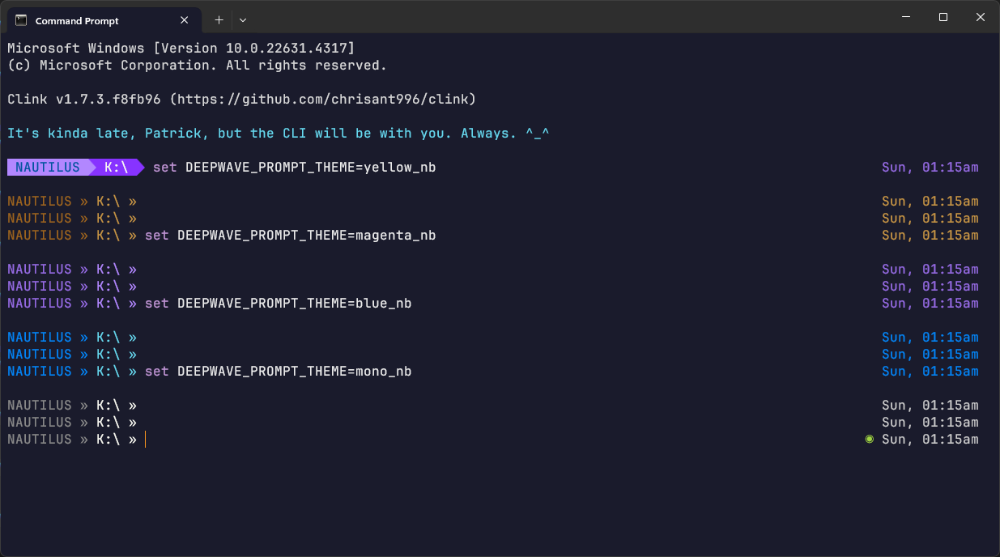
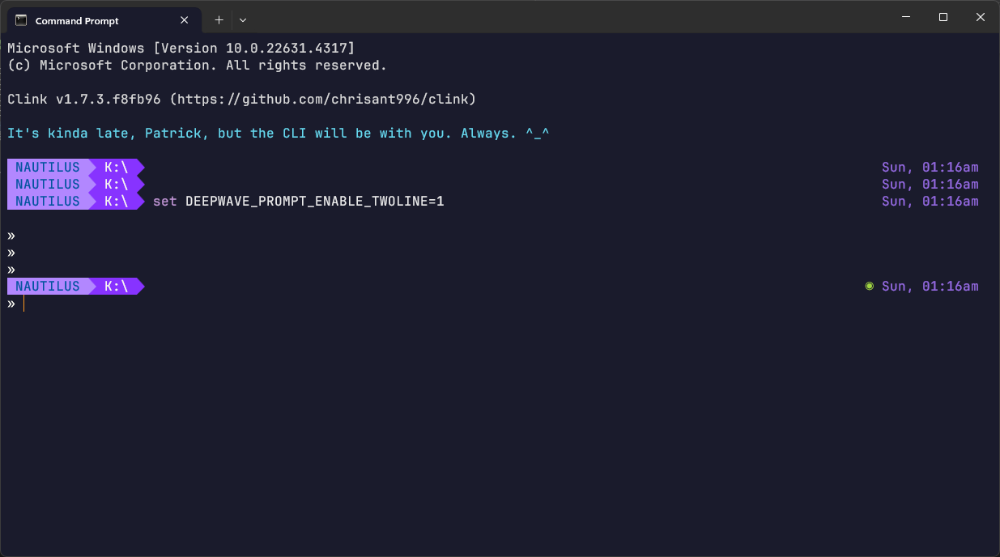

# DeepWave clinkprompt

This prompt module for [clink](https://github.com/chrisant996/clink) is a simple one. While it draws inspiration from a number of other prompts, it is primarily Windows-first, and not a *nix port. It is for power users of the command line (that's why we use `clink`) who see the venerable `C:\>` as its own unique shell *identity* **^_^**.

Though it is simple, it includes various options such as displaying timestamps, computer names, muting of old prompts, error indicators, battery/power indicators, drive status indicators, single/two-line prompts and a few different background/no-background theme colours - all of which can be enabled/disabled on-the-fly with simple environment variables.

There is no `git` support here, so please try one of the other, very good, prompt modules if that is what you're looking for. Unlike *nix, `git` is not installed by default in Windows. Similarly, we don't look out for things like `~` because by default, you can't `cd ~` on Windows. And if you don't have/want to install new fonts, there are a couple of themes that work fine with the default `Consolas` font as well.

### Options and Settings

You can customise your prompt in multiple ways, and optionally show or hide the following display/modes:

* Right Timestamp
* Computer Name
* Previous Command Error Indicator
* Mute Old Prompts
* Single-Line or Two-Line Prompt
* Battery Level / AC Power Indicator
* Removable / Network / Inaccessible Drive Indicator
* Multiple Colour Themes and Colour Modes
* Greeting Message

These features can be set/enabled/disabled on-the-fly by setting various environment variables. Changing these settings will affect the current terminal immediately. If you want these settings to be the default, set them as your default environment variables.

| Setting                   | Default   | To Change (hide or show as the case may be) |
| ------------------------- | --------- | ------------------------------------------- |
| Right Timestamp           | Show      | `set DEEPWAVE_PROMPT_DISABLE_TIMESTAMP=1 `  |
| Computer Name             | Show      | `set DEEPWAVE_PROMPT_DISABLE_HOSTNAME=1 `   |
| Error Indicator           | Show      | `set DEEPWAVE_PROMPT_DISABLE_ERRORIND=1`    |
| Mute Old Prompts *        | Yes       | `set DEEPWAVE_PROMPT_DISABLE_MUTEOLD=1`     |
| Two-Line Prompt *         | No        | `set DEEPWAVE_PROMPT_ENABLE_TWOLINE=1`      |
| Battery Level Indicator * | Yes       | `set DEEPWAVE_PROMPT_DISABLE_BATTERYIND=1`  |
| Drive Status Indicator *  | Yes       | `set DEEPWAVE_PROMPT_DISABLE_DRVTYPEIND=1`  |
| Theme                     | `magenta` | `set DEEPWAVE_PROMPT_THEME=theme_name`      |
| Colour Mode               | `dw`      | `set DEEPWAVE_PROMPT_COLOUR_MODE=mode_name` |
| Greeting Message          | Yes       | `set DEEPWAVE_PROMPT_DISABLE_GREETING=1`    |

Notes:

* Both *Mute Old Prompts* and *Two-Line Prompt* requires `clink set prompt.transient always` or `same_dir`.

* Both *Drive Status Indicator* and *Battery Level Indicator* may require installing and using a font with broader character support - see the section on **Themes**.

Here's an example of hiding the *Timestamp* and *Computer Name*.

### Themes

There are two types of themes - those with a background, and those without.

To use a theme with a background, you may need to install and configure a font with broader character support (eg. [JetBrains Mono](https://www.jetbrains.com/lp/mono/), [Nerdfonts](https://www.nerdfonts.com/font-downloads) or [Powerline fonts](https://github.com/powerline/fonts)). Otherwise, you will most likely see some strange characters in your prompt.

By default, `cmd.exe` (and `Windows Terminal`) uses `Consolas`, which does *not* have the correct character support. In that case, please use one of the themes that does **<u>not</u>** have a background.

| Theme                      | To Activate                            |
| -------------------------- | -------------------------------------- |
| Blue                       | `set DEEPWAVE_PROMPT_THEME=blue`       |
| Magenta (*Default*)        | `set DEEPWAVE_PROMPT_THEME=magenta`    |
| Yellow                     | `set DEEPWAVE_PROMPT_THEME=yellow`     |
| Monochrome                 | `set DEEPWAVE_PROMPT_THEME=mono`       |
| Blue (No Background)       | `set DEEPWAVE_PROMPT_THEME=blue_nb`    |
| Magenta (No Background)    | `set DEEPWAVE_PROMPT_THEME=magenta_nb` |
| Yellow (No Background)     | `set DEEPWAVE_PROMPT_THEME=yellow_nb`  |
| Monochrome (No Background) | `set DEEPWAVE_PROMPT_THEME=mono_nb`    |

Here's a look at some of these themes, firstly with backgrounds, and then without. All of the screenshots on this page were taken with *Mute Old Prompts* disabled.

##### Colour Modes

It should be noted that the colour of the prompts you see on your screen may depend on the terminal software you use and its settings. In order to tweak that, you can set the Colour Mode in addition to the Theme. There are four modes to choose from - `dw`, `cga`, `td`, and `org`. `dw` is the default, and are the colours you see in these screenshots. `cga` are the colours as defined in the original 4-bit ANSI colour codes. `td` and `org` are basically the same as `cga`, but may be modified by the terminal software you are using.

Generally, if you want to experience colours the way it was back in the day, then you should choose `cga`, otherwise for the most part, `dw` is more user friendly.

On a technical level, `dw` and `cga` uses modern "true colour" 16-bit escape sequences, `td` uses VGA 8-bit escape sequences and `org` uses the original CGA 4-bit escape sequences. 

### Two-Line Prompt Mode

A *Two-Line Prompt* mode is available for those who prefer a less "crowded" display. When Two-Line Prompt is active, we hide the *Right Timestamp* and the 1st Prompt Line for Old Prompts, but retain the option to fully display all the other information.

Here's a minimalist *Two-Line Prompt* mode.

### Drive Indicator

A very common problem is wanting to know more about the status of the current drive. A drive indicator is added to the start of the current path if the drive is a network drive, a removable drive or if the drive is currently inaccessible (the removable media was removed, or permissions to access the drive is insufficient). In the screenshot below, the USB drive at `D:\` was removed for a short while, and then reinserted.

### Error Indicator

Here is how the *Error Indicator* is handled with *Mute Old Prompts* enabled. It appears when the most recent command returned an error.

### Demo / Settings Display

Starting in clink 1.7.4, you can check the current settings for the prompt, as well as see how other themes and settings might look like, by using the command `clink config prompt show DeepWave`.

### Requirements and Installing

1. Install the latest version of [clink](https://github.com/chrisant996/clink/releases) (at least version 1.7.0, which supports `*.clinkprompt` custom prompt files)
2. Download the [DeepWave.clinkprompt](DeepWave.clinkprompt) file to the [clink theme](https://chrisant996.github.io/clink/clink.html#custom-prompts) folder
3. Activate the prompt with `clink config prompt use DeepWave` 
4. *[Optional]* Install and configure `Windows Terminal` or `cmd.exe` to use a font with broader character support to use one of the themes with a background
5. *[Optional]* Configure the prompt settings if you need to, using environment variables

### Changelog

**1.1** 

* Added Drive Indicators
* Added Battery / Power Indicators
* Changed option to disable Mute Old Prompts independent of clink's settings
* Standardised the colour display system and introduced colour modes

**1.0**

* Initial Release

### Thanks and Acknowledgements

Thanks to, Inspiration and Code from:

* [clink](https://github.com/chrisant996/clink)
* [agnoster](https://github.com/agnoster/agnoster-zsh-theme)
* [pure](https://github.com/sindresorhus/pure)

This code is MIT Licensed - Feel free to share and adapt, but please attribute.

And if you like this prompt, or if you fork/reference/use it, do drop me a note to say hi. I'd love to hear how my code is useful to others and where it has travelled to. ^_^
